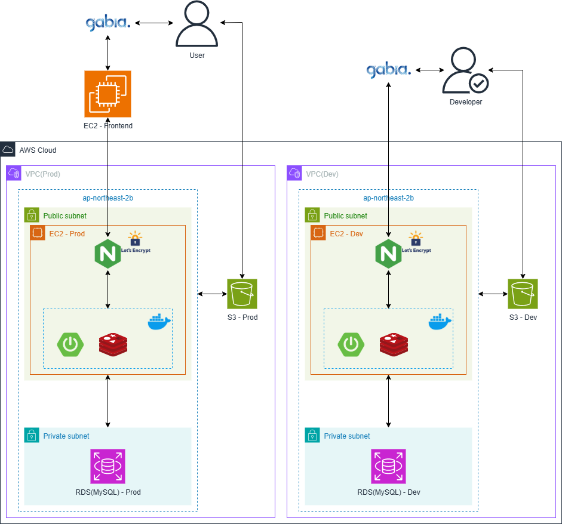

## 개인&그룹 AI 가계부 서비스, Dalcoomi

**서비스 바로가기** ➡ https://dalcoomi.com
  

## 🍭 Introduction

### Dalcoomi는 개인과 그룹을 위한 AI 가계부 서비스입니다.

#### ⭐ 간편한 가계부 작성이 가능해요

거래 내역을 수기로 작성 시 이것저것 작성해야 하는 귀찮고 번거로운 과정을 해결하고자 작성 과정을 최대한 간소화했어요. 정말 빠르고 간단하게 수기 작성이 가능해요.

#### ⭐ 영수증 사진을 AI가 분석해요

영수증 사진만 업로드하면 **AI**가 분석해서 자동으로 거래 내역을 작성해 줍니다. 영수증에 적혀있는 다수의 거래 내역을 일일이 작성해야 하는 불편함을 해결했어요.

#### ⭐ 그룹 기능을 제공해요

그룹을 만들고 친구나 동료를 초대해서 공동으로 가계부를 관리할 수 있습니다. 또한 그룹 가계부에서 거래 내역 작성 시 해당 거래 내역 데이터는 개인 가계부와 동기화가 가능해요.

## 🍭 Architecture

## 🍭 Contributor

<table>
  <tr>
    <td align="center"><strong>Web FE & Server</strong></td>
  </tr>
  <tr>
    <td align="center"><a href="https://github.com/fakerdeft">
  </tr>
  <tr>
    <td align="center"><a href="https://github.com/fakerdeft"><b>fakerdeft</b></td>
  </tr>
</table>
